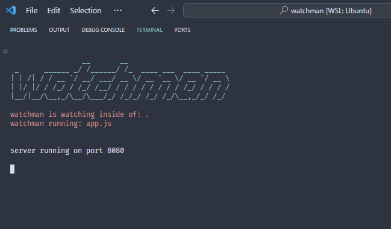

# watchman
watchman is a package that will reload its js file with every change you make.

It is worth mentioning that to carry out this project, the author was inspired by existing packages such as nodemon, restart etc...

[](https://standardjs.com)
[](https://opensource.org/licenses/MIT)


# installation
to start using watchman, in your projects you can use:

```bash
npm i @nelson_echeverria/watchman --save-dev
```

or with shortcuts:

```bash
npm i @nelson_echeverria/watchman -D
```

# behavior
watchman will observe the folder in which the file passed by parameter is located, ignoring everything outside of it.

# usage
to implement watchman in your project, you can call watchman as a function and pass it the file name you want to monitor.

It would look something like this from **src/index.js**:

```js
// ECMAScript modules
import watchman from '@nelson_echeverria/watchman'

if(process.env.NODE_ENV === 'developement'){
    watchman('./app.js')
}
```

```js
// commonJS modules
const watchman = require('@nelson_echeverria/watchman').default

if(process.env.NODE_ENV === 'developement'){
    watchman('./app.js')
}
```

and look like this, into package.json:

```json
{
    "scripts": {
        "start:dev": "NODE_ENV=development node ./app.js"
    }
}
```

# example - wachman in action


# license
watchman was developed under the MIT license